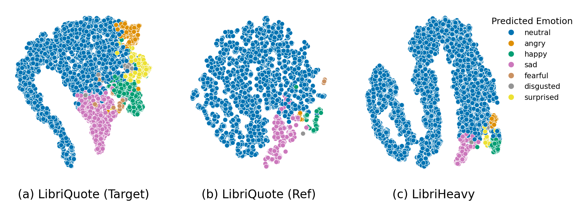

# LibriQuote:  Speech Dataset of Fictional Character Utterances for Expressive Zero-Shot Speech Synthesis
This repository contains helper functions to process LibriQuote data, and benchmark expressive TTS systems using LibriQuote-test.

This repository contains:

- Helper python classes to process LibriQuote in the [`processing/`](processing/) folder
- Evaluation scripts to benchmark TTS systems on LibriQuote-test in the [`evaluation/`](evaluation/) folder.
- The LibriQuote dataset hosted on [HuggingFace](https://huggingface.co/datasets/gasmichel/LibriQuote).


</body>
    <p style="text-align: justify;" >
        <b>Figure 1.</b> t-SNE projection of emotion vector representations computed with <i>emotion2vec-plus-base</i>. LibriQuote-<i>test</i>  (a) quotations and (b) reference narration (non-quotation) utterances; (c) Subsample of LibriHeavy segments (N=5734).
    </p>

# Links 

- [Paper](https://arxiv.org/pdf/2509.04072)
- [Dataset](https://huggingface.co/datasets/gasmichel/LibriQuote/tree/main)
- [Audio samples from the paper](https://libriquote.github.io/)

# Benchmarking Only 

If you use LibriQuote-test only for benchmarking, we provide target and reference samples (in 16KHz) directly in the [HuggingFace repository](https://huggingface.co/datasets/gasmichel/LibriQuote/tree/main/test_audios). Check-out the [`evaluation/`](evaluation/) folder to find evaluation scripts.

#  LibriLight Audio Files

LibriQuote comes with segments derived from narration paragraphs and quotation from characters in fiction novels. It is derived from LibriVox recordings, and currently uses LibriLight audio files as backend audio files. Note that these audio files are encoded in 16KHz.

Please follow [LibriLight instructions](https://github.com/facebookresearch/libri-light/blob/main/data_preparation/README.md) to download and prepare audio files.

We provide a [bash script](librilight_matching/) that will `untar` only necessary LibriQuote files, reducing the overall processing time and total disk space required

# Processing LibriQuote

Find more information in the [`processing/`](processing/) folder.

# Benchmarking using LibriQuote-test

Find more information in the [`evaluation/`](evaluation/) folder.

# Citing 

If you use LibriQuote or part of this code in your publications, you can cite this work with the following BibTex entry:

```bibtex
@misc{Michel2025LibriQuote,
    title={LibriQuote: A Speech Dataset of Fictional Character Utterances for Expressive Zero-Shot Speech Synthesis}, 
    author={Gaspard Michel and Elena V. Epure and Christophe Cerisara},
    year={2025},
    eprint={2509.04072},
    archivePrefix={arXiv},
    primaryClass={eess.AS},
    url={https://arxiv.org/abs/2509.04072}
}
```
